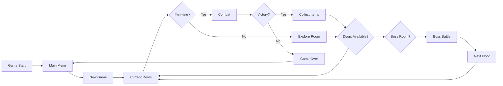

## Roguelike RPG Game

## Team
- **arce0827** – Project Lead, Game Designer, Developer

## Description
A top-down roguelike RPG inspired by The Binding of Isaac. The game features procedurally generated dungeons, real-time combat, collectible items, and progressive difficulty. Players navigate through randomly generated rooms, fight enemies, collect power-ups, and face challenging bosses.

## Project Structure

### Player
- Movement and shooting controls
- Health and statistics management
- Item collection and effects
- Tear/projectile system

### Game Engine
- Game loop (60 FPS)
- Collision detection system
- Animation management
- Audio system

### World Generation
- Procedural room generation
- Enemy spawning system
- Item placement algorithm
- Boss room creation

### Game Systems
- Combat mechanics
- Item effects and synergies
- Scoring and progression
- Save/load functionality

## Use Cases
1. **Player Movement**: 8-directional movement with WASD keys
2. **Combat System**: Shoot tears/projectiles with arrow keys, damage enemies
3. **Item Collection**: Pick up items that modify player stats and abilities
4. **Room Progression**: Clear rooms to unlock doors and progress through floors
5. **Boss Battles**: Face powerful enemies with unique attack patterns
6. **Game Progression**: Unlock new items and characters through gameplay

## Game Flow



## Infrastructure
Technologies used for the project:
- **[SFML](https://www.sfml-dev.org/)** — Graphics, audio, and input handling
- **[nlohmann/json](https://github.com/nlohmann/json)** — Configuration and save data serialization
- **C++17** — Core programming language
- **CMake** — Build system management

## Repository
Project repository:  
[GitHub Repository Link] (To be created)

---

## Development Log

|    Date    | Time From | Time To | Breaks | Activity | Description | Result |
|------------|-----------|---------|--------|----------|-------------|--------|
| 2025-07-02 | 18:00 | 20:10 | - | A&D | Simple coding and implementations of classes | Finished GameEngine.cpp/.hpp and Player.cpp/.hpp |
| TBD | - | - | - | - | - | - |
| TBD | - | - | - | - | - | - |

---

## Backend Development Plan (Phase 1)

- Create header files for core classes (*Player.hpp*, *Room.hpp*, *GameEngine.hpp*, etc.) ⏳
- Implement corresponding `.cpp` files with class functionality ⏳
- Create *GameEngine* class: ⏳
  - Manages game loop at 60 FPS
  - Handles input processing
  - Manages game states (menu, gameplay, pause)
- Create *Player* class: ⏳
  - Stores player position, health, stats
  - Handles movement and shooting mechanics
  - Manages item effects and stat modifications
- Create *Projectile* class: ⏳
  - Handles tear/bullet physics
  - Manages collision with enemies and walls
  - Supports different projectile types
- Create *Enemy* class hierarchy: ⏳
  - Base enemy class with common behavior
  - Specific enemy types with unique patterns
  - AI for movement and attacking
- Create *Room* class: ⏳
  - Stores room layout and dimensions
  - Manages enemy and item spawning
  - Handles door states and transitions
- Create *Item* class: ⏳
  - Defines collectible items with effects
  - Manages stat modifications and special abilities
  - Supports item stacking and synergies
- Create main `main.cpp` file for testing: ⏳
  - Basic game initialization
  - Simple room with player movement
  - Basic collision testing

## Graphics and Audio Plan (Phase 2)

- Set up SFML graphics pipeline ⏳
- Create sprite management system ⏳
- Implement animation system:
  - Player movement animations ⏳
  - Enemy animations ⏳
  - Projectile effects ⏳
- Audio system implementation:
  - Background music management ⏳
  - Sound effect integration ⏳
  - Audio volume controls ⏳
- UI system development:
  - Health display ⏳
  - Item inventory ⏳
  - Score and statistics ⏳

## Game Systems Plan (Phase 3)

- Procedural generation system ⏳
- Room connection algorithm ⏳
- Item effect system:
  - Stat modifications ⏳
  - Visual changes ⏳
  - Special abilities ⏳
- Boss battle mechanics ⏳
- Save/load system ⏳
- Menu system (main menu, pause, game over) ⏳
- Game balancing and testing ⏳

## Classes and Functionality

| Class | Responsibility |
|-------|----------------|
| `GameEngine` | Main game loop, state management, input handling |
| `Player` | Player character data, movement, shooting, stats |
| `Projectile` | Bullet/tear physics, collision, damage |
| `Enemy` | Enemy AI, movement patterns, health, attacks |
| `Room` | Room layout, spawning, door management |
| `Item` | Collectible items, stat effects, abilities |
| `RoomGenerator` | Procedural room creation and connection |
| `CollisionManager` | Handles all collision detection |
| `AudioManager` | Music and sound effect management |
| `RenderManager` | Graphics rendering and animation |
| `UIManager` | User interface elements and HUD |

## 📁 Project Structure

| Directory / File | Description | Status |
|------------------|-------------|--------|
| `src/main.cpp` | Program entry point | ⏳ **(partially done, will be updated more)** |
| `src/core/GameEngine.hpp` | Main game engine header | ⏳ **(partially done, will be updated more)**|
| `src/core/GameEngine.cpp` | Game engine implementation | ⏳ **(partially done, will be updated more)**|
| `src/entities/Player.hpp` | Player character header | ⏳ **(partially done, will be updated more)**|
| `src/entities/Player.cpp` | Player character implementation | ⏳ **(partially done, will be updated more)**|
| `src/entities/Enemy.hpp` | Enemy base class header | ⏳ **(partially done, will be updated more)**|
| `src/entities/Enemy.cpp` | Enemy base class implementation | ⏳ **(partially done, will be updated more)**|
| `src/entities/Projectile.hpp` | Projectile class header | ⏳ **(partially done, will be updated more)**|
| `src/entities/Projectile.cpp` | Projectile class implementation | ⏳ **(partially done, will be updated more)**|
| `src/world/Room.hpp` | Room class header | ⏳ |
| `src/world/Room.cpp` | Room class implementation | ⏳ |
| `src/world/RoomGenerator.hpp` | Procedural generation header | ⏳ |
| `src/world/RoomGenerator.cpp` | Procedural generation implementation | ⏳ |
| `src/items/Item.hpp` | Item system header | ⏳ |
| `src/items/Item.cpp` | Item system implementation | ⏳ |
| `src/managers/CollisionManager.hpp` | Collision detection header | ⏳ **(partially done, will be updated more)** |
| `src/managers/CollisionManager.cpp` | Collision detection implementation | ⏳ **(partially done, will be updated more)** |
| `src/managers/AudioManager.hpp` | Audio management header | ⏳ |
| `src/managers/AudioManager.cpp` | Audio management implementation | ⏳ |
| `src/managers/RenderManager.hpp` | Graphics rendering header | ⏳ |
| `src/managers/RenderManager.cpp` | Graphics rendering implementation | ⏳ |
| `src/ui/UIManager.hpp` | User interface header | ⏳ |
| `src/ui/UIManager.cpp` | User interface implementation | ⏳ |
| `assets/sprites/` | Game sprites and textures | ⏳ |
| `assets/audio/` | Sound effects and music | ⏳ |
| `config/` | Game configuration files | ⏳ |

## Build Instructions

Before compiling, ensure you have SFML installed:

### Windows (Visual Studio)
```bash
# Install SFML via vcpkg or download from official website
# Configure CMake with SFML path
cmake -DCMAKE_TOOLCHAIN_FILE=[vcpkg-root]/scripts/buildsystems/vcpkg.cmake ..
cmake --build .
```

### Linux
```bash
# Install SFML
sudo apt-get install libsfml-dev

# Build project
mkdir build && cd build
cmake ..
make
./arces
```

### CMake Configuration
```cmake
cmake_minimum_required(VERSION 3.10)
project(arces)

set(CMAKE_CXX_STANDARD 17)

find_package(sfml 3.0 COMPONENTS graphics window system audio REQUIRED)

# Add executable and link libraries
add_executable(arces src/main.cpp)
target_link_libraries(arces sfml-graphics sfml-window sfml-system sfml-audio)
```

## Game Features

### Core Mechanics
- **Real-time Combat**: Fast-paced shooting with various projectile types
- **Procedural Generation**: Each playthrough features unique room layouts
- **Item Synergies**: Items combine for powerful effects
- **Progressive Difficulty**: Enemies become stronger on deeper floors
- **Multiple Enemy Types**: Different behaviors and attack patterns

### Items System
- **Passive Items**: Permanent stat modifications (damage, health, speed)
- **Active Items**: Rechargeable abilities with special effects
- **Consumables**: Single-use items for immediate benefits

### Visual Features
- **Sprite Animation**: Smooth character and enemy animations
- **Particle Effects**: Visual feedback for actions and impacts
- **Dynamic Lighting**: Atmospheric lighting effects
- **Screen Effects**: Visual indicators for item pickups and damage

**A&D** - Analysis and Design  
**C** - Coding  
**T&R** - Testing and Code Review
